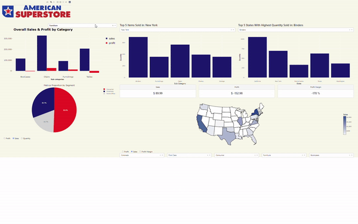
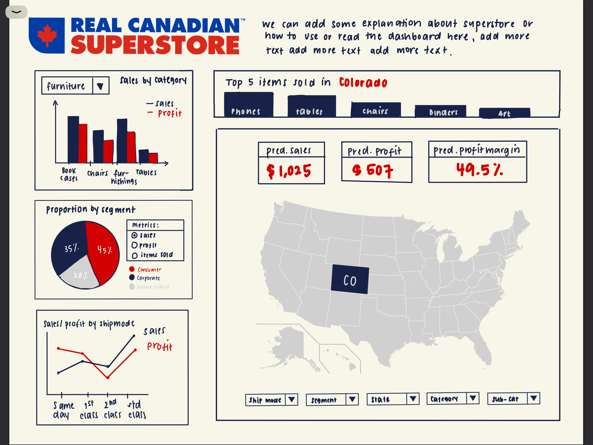

# Superstore Sales Dashboard (R)  

**Please adjust zoom of your screen to 50% to see all dropdowns properly**  

Link to the deployed app: 
   
[OUR APP](https://the-superstore-dash.herokuapp.com/) 

## Introduction    

Managing one of the biggest supermarket chain in the United States is no easy task. Tracking sales and profit figures across different states and segments can be challenging as there is a lot of data to process. Data visualization tools such as a sales dashboard can help paint a clearer picture of the performance of the stores in each state and segments. Our app will enable the target audience to explore different sales metrics for each state in order to better understand what factors contribute to a higher profit. Finally, this tool will help the marketing team target which category of products they should focus their efforts on.

Feel free to navigate to the following sections to find out more about our dashboard! 

* [The problem we are trying to address](#The-problem)
* [The solution we are proposing](#The-solution)
* [Short description of our dashboard](#About-our-Dashboard)
* [Components of our dashboard](#Components)
* [Description of the data we used](#Dataset)
* [Reference to the kaggle dataset](#References)
* [How you can contribute to our project](#Contributors’/Developers’-Guide)

## The problem
 
- The American Superstore’s marketing team wants to be able to visualize their entire sales figures in a more concise and aesthetically pleasing way.

- They want to identify product categories and regions where sales and profit are exceeding expectations. This way, they can maintain their marketing strategies in these areas and change them for the areas where these metrics don’t measure up. 

## The solution
 
The Superstore Sales Dashboard app will:
 
- Make it easy for the American Superstore managers to view their entire database of sales figures in a dashboard format with custom charts and filters.

- Deliver information that is useful for making important marketing and sales decisions.

- Identify areas of weaknesses and strengths in their business.

- Offer a UI to filter for specific sales metrics or regions to detect potential performance discrepancies.

## About our Dashboard

Our dashboard aims to track the sales, profit and profit margin for all the *American Superstore*[^1] stores across the United States. Tracking of sales, profit and profit margin can be achieved by visualizing these metrics across different variables of interest such as `Ship Mode`, `Market Segment`, `State`, `Category` and `Sub-category` of items. Tracking sales and profits across different variables of interest is essential as it helps the audience better understand the current situation of the stores and enables them to notice which factors contribute most to the sales and profit. In doing so, better decisions can be made in order to guarantee the *American Superstore*'s success.

## Components

Our dashboard aims to present the sales, profit and profit margin for all American Superstore stores across the United States. There are five main components in our dashboard which are:

**1. Sales by Category Bar Plot**      
This plot shows the sales and profit of the stores with respect to different sub-categories on the x-axis. This plot will have a drop-down menu which will filter the data by category (furniture, office supplies, and technology). Sales and profit figures are stacked together and differentiated by two different colored bars.

**2. Metrics Proportion by Segment Pie Chart**     
This plot shows the metrics proportion by segment. There are three segments in our data (consumer, corporate, and home office), each will have a different color and three metrics (sales, profit, and items sold) that the user can choose from the radio button options.

**3. Top Five Items Sold Bar plot**      
This plot shows the top five items sold in a particular state. The states data for this plot will change if the user selects a different state through the US Map or the state drop-down menu below the US Map. 

**4. Top Five States with Highest Quantity Sold of an Item**      
This plot shows the top five states which highest quantity sold a particular item. The items data for this plot will change if the user selects a different item through the drop-down menu.

**5. US Map**      
There are three components inside this plot. The first one is a drop-down menu that the user can select to filter the data for the whole dashboard. Changing the selection of the drop-down menu will update which state is highlighted in the US Map, the sales card, the profit card, the profit margin card as well as the selection for the other five plots discussed above. 

## Dataset

The dataset contains details for the orders of a supermarket chain in the United States, sourced from Kaggle [https://www.kaggle.com/nazarmahadialseied/superstore-sales]. This dataset will help us to understand which attribute has affected the sales and profit for the superstore sales. The dataset consists of 13 different attributes of a sample of entries. Attributes are ordinal, categorical and quantitative. Each of the rows (9994 samples) corresponds to a combination of attributes like ship mode, segment, country, city, state, postal code, region category, sub-category, quantity, and discount with the sales and profit associated with them. The goal of this data is to illustrate valuable insights such as average sales, profits for different regions, categories, etc. This could help the stores in building better marketing strategies. These estimates could also be used to identify which sector of the market is under loss and which sector is making the most profit. This would lead the business team in making better decisions to ensure the stores' profitability.     
       
## Contributors’/Developers’ Guide     

We are thankful and appreciate your efforts and thoughts in contributing to our dashboard. We are willing to get suggestions and advice to brush up on its functionality, efficiency, interactivity, or usage. Your skills and expertise will be a great addition to our dashboard. This is a simple guide to help you understand our dashboard in depth and how it works.     
- **Installation:**  
    - Clone the project’s GitHub repository.     
    - Open a terminal in the project directory and use the command `R app.R`.    
    - Navigate to the localhost:8050 in your web browser to view the working dashboard.       
      
- **Useful Links:**   
You can refer to these documentations:    
    - [Dash](https://dash.plotly.com/)      
    - [Altair](https://altair-viz.github.io/)    
    - [Plotly](https://plotly.com/python/)     
    
- **Workflow:**     
Developers should follow the basic rules of working in a GitHub project workflow ([GitHub workflow](https://docs.github.com/en/get-started/quickstart/github-flow)). We highly recommend going through the `CODE_OF_CONDUCT.md` and `team_contract.md` files before starting work.      
    
Please feel free and respectful to contact us by email. Raise project related issues [here](https://github.com/ubco-mds-2021-labs/dashboard1-group-e/issues).     

---
      
## References 

Dataset link: https://www.kaggle.com/nazarmahadialseied/superstore-sales

[^1]: This is a fictional name.
